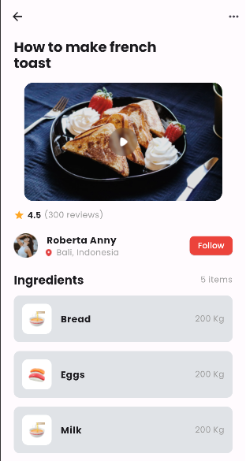

# Food Recipe App Solution

## Project Overview
The provided Flutter code is for a Food Recipe App with little animation effects. The app includes various sections like a title, video background, rating, author profile, and ingredients. The animations are applied using the `FadeTransition` widget to create a visually appealing entrance effect for each section.

## 1. Appbar (`Appbar_` Widget)
- The `Appbar_` widget represents the app bar with a specific design, and it is used as the top navigation bar.

## 2. Home Page (`MyHomePage` Widget)
- The `MyHomePage` widget is the main home page of the app, which is a stateful widget.
- It includes several animated sections: title, video background, rating, author profile, and ingredients.
- Animation is achieved using the `FadeTransition` widget along with `AnimationController` and `CurvedAnimation` for smooth entrance effects.

## 3. Animation Controller (`_firstcontroller`)
- An instance of `AnimationController` is used to control the animations on the home page.
- The controller has a duration of 1000 milliseconds, and it is responsible for animating each section.

## 4. Animations
- Four animations (`_firstanimation`, `_secondanimation`, `_thirdanimation`, `_fourthanimation`) are created, each using different easing curves (bounce, easeIn, easeInCirc, easeInQuad).
- These animations are applied to different sections of the home page to create varied entrance effects.

## 5. Disposal of Animation Controller
- The `_firstcontroller` is properly disposed of in the `dispose` method to free up resources when the widget is removed from the widget tree.

## How to Run the App
1. Make sure you have Flutter installed on your machine.
2. Clone the project or create a new Flutter project and replace the existing files.
3. Open a terminal in the project directory.
4. Run the command `flutter pub get` to install dependencies.
5. Run the command `flutter run` to launch the app on an emulator or connected device.

## Project Structure
- The project is organized into multiple files and widgets for better code organization.
- The `static_constants.dart` file contains constant variables for the app, such as title, background image, rating, reviews, user details, etc.
- The `widgets` directory contains separate files for different sections of the app, like the app bar, video, rating, author profile, and ingredients.

Feel free to explore and customize the code based on your specific requirements. The animations can be adjusted, and additional features can be incorporated as needed.

## Snapshot
# Screenshot of foodrecipe app
